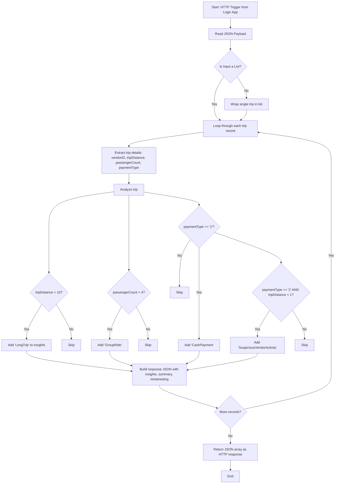

# 🚖 Real-Time Trip Monitoring Azure Function
### 📸 Demo Video 📹

🎥 Watch the demo here:  👉 🧪🔍🔁📁
**[▶️ YouTube Video Link](https://youtu.be/tT-EN_qwNzU)**

---
## 🔁 Booking Processing Workflow

Taxi dispatch networks generate large volumes of trip data in real time. To ensure service quality, safety, and operational insights, it's crucial to monitor this data as it arrives, analyze it immediately, and flag unusual patterns.

**We will implement a real-time event-driven system that:**
- Ingests taxi trip events from an Event Hub
- Uses an Azure Function to analyze trips for patterns (like group rides, cash payments, or suspiciously short rides)
- Routes this analysis through a Logic App
- Posts rich Adaptive Cards to Microsoft Teams to alert operations staff

**This allows dispatchers and supervisors to:**
- Immediately spot anomalies
- Monitor high-volume group rides
- Track vendors with suspicious activity
- Reduce manual review time

<div align="center">
  
</div>


We create the following:
- **A namespace** is a container for all messaging components (queues and topics).
- **Azure Event Hubs** is a big data streaming platform and event ingestion service provided by Microsoft Azure.
- **Azure Logic Apps** enables you to automate workflows using a visual designer by connecting various services and triggers, both within Azure and from external systems like Microsoft Teams, Outlook, Salesforce, SQL, and Event Hubs.
- **Function App** to analyze incoming taxi trips for patterns (like group rides, cash payments, or suspiciously short rides), to detect unusual patterns in real-time.


## 📌 Tasks
### ✅ 1. Set Up Event Ingestion
  **1.1 Create Azure Resources:** (use JSON format)
- **Event Hub Namespace** is a container for all messaging components (queues and topics).
- **Azure Event Hubs** inside the namespace is a big data streaming platform and event ingestion service provided by Microsoft Azure.
- **Azure Logic Apps** (Consumption Plan) enables you to automate workflows using a visual designer by connecting various services and triggers, both within Azure and from external systems like Microsoft Teams, Outlook, Salesforce, SQL, and Event Hubs.

**1.2 Send Events:**
- Configure Azure Logic App to trigger When events are available in Event Hub (use batch mode).
This function receives JSON-formatted trip events from Event Hub (via Logic App), analyzes each trip based on distance, passenger count, and payment type, and returns structured insights.
<div align="center">  
  
</div>


### ✅ 2. Create Azure Function
**2.1 Create Azure Function App:**
- Use Python as the runtime stack.
- Deploy the following code to your Function:

```python
import azure.functions as func
import logging
import json

app = func.FunctionApp(http_auth_level=func.AuthLevel.ANONYMOUS)

@app.route(route="")
def analyze_trip(req: func.HttpRequest) -> func.HttpResponse:
    try:
        input_data = req.get_json()
        trips = input_data if isinstance(input_data, list) else [input_data]

        results = []

        for record in trips:
            trip = record.get("ContentData", {})  # ✅ Extract inner trip data

            vendor = trip.get("vendorID")
            distance = float(trip.get("tripDistance", 0))
            passenger_count = int(trip.get("passengerCount", 0))
            payment = str(trip.get("paymentType"))  # Cast to string to match logic

            insights = []

            if distance > 10:
                insights.append("LongTrip")
            if passenger_count > 4:
                insights.append("GroupRide")
            if payment == "2":
                insights.append("CashPayment")
            if payment == "2" and distance < 1:
                insights.append("SuspiciousVendorActivity")

            results.append({
                "vendorID": vendor,
                "tripDistance": distance,
                "passengerCount": passenger_count,
                "paymentType": payment,
                "insights": insights,
                "isInteresting": bool(insights),
                "summary": f"{len(insights)} flags: {', '.join(insights)}" if insights else "Trip normal"
            })

        return func.HttpResponse(
            body=json.dumps(results),
            status_code=200,
            mimetype="application/json"
        )

    except Exception as e:
        logging.error(f"Error processing trip data: {e}")
        return func.HttpResponse(f"Error: {str(e)}", status_code=400)
```
Absolutely! Here's a **flowchart** representing the logical flow of your **Azure Function trip analysis app**, from receiving input to producing the insights.

---

### 📊 Azure Function Trip Analysis – Flowchart




### ✅ 3. Add Logic App Processing


<div align="center">  
  
</div>


### ✅ 4. Post Adaptive Cards to Microsoft Teams

### 💬 yellowtaxiapp: is a Logic App that:
-  Listens to trip data (probably from Event Hubs or HTTP requests),
-  Sends it to an Azure Function for analysis,
-  Posts results to a Teams channel, email, or logs them.

  use the following post cards:
- Not Interesting Trip Card
- Interesting Trip Card
- Suspicious Vendor Activity

### ✅ 5. Microsoft Teams Test

<div align="center">  
  
</div>


